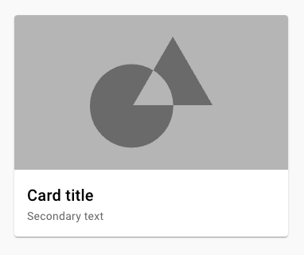

Crie um componente de Card utilizando componentes react:

- O componente receberá 3 props: título, texto e imagem

- Renderizar o card como o do exemplo anexado

- O card deverá ser clicável, e ao clicar, ele deve mudar a cor. Exemplo: o card está branco, ao clicar ele passa a ser azul, ao clicar novamente ele volta a ser branco

  
